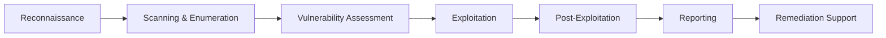

<div align="center">

# Srishti Rathi

### Cybersecurity Researcher | VAPT Specialist | Threat Intelligence Analyst | Malware Investigator

[](https://www.linkedin.com/in/srishti-rathi-b487a9253/)
[](https://srishticode.github.io/index.html#home)
[](YOUR_TRYHACKME)
[](mailto:rathisrishti@gmail.com)


</div>

---

## About Me

```python
class CybersecurityResearcher:
    def __init__(self):
        self.name = "Srishti Rathi"
        self.role = "Security Researcher & Penetration Tester"
        self.education = "B.Tech. Computer Engineering | J.C. Bose University"
        self.specializations = [
            "Vulnerability Assessment & Penetration Testing",
            "Threat Intelligence & OSINT",
            "Malware Analysis & Reverse Engineering",
            "Application Security Testing",
            "IOC Analysis & Threat Hunting"
        ]
        self.current_status = "🔴 Open to Security Research & VAPT Opportunities"
    
    def get_expertise(self):
        return {
            "Penetration Testing": ["Web App Testing", "API Security", "Network Pentesting", "OWASP Top 10"],
            "Threat Intelligence": ["OSINT", "IOC Analysis", "Threat Actor Profiling", "Dark Web Research"],
            "Malware Analysis": ["Static Analysis", "Dynamic Analysis", "Behavioral Analysis", "Reverse Engineering"],
            "Security Tools": ["Burp Suite", "Metasploit", "Nmap", "Wireshark", "IDA Pro", "Ghidra"],
            "Programming": ["Python", "Bash", "PowerShell", "Assembly (x86/x64)"]
        }
```

🏆 **Smart India Hackathon Winner** | 🎖️ **Top 1% TryHackMe** | 🐞 **Active Bug Bounty Hunter** | 🔬 **Malware Researcher**

---

## Professional Experience

###  Independent Security Researcher
**July 2025 – Present**

```yaml
Vulnerability Assessment & Penetration Testing:
  - Web application security assessments (OWASP & PTES methodologies)
  - API security testing and GraphQL DoS vulnerability research
  - IDOR, XSS, SQLi, and business logic flaw identification
  - Network penetration testing and privilege escalation
  - Responsible disclosure to multiple organizations

Threat Intelligence Operations:
  - Threat actor TTPs analysis and campaign tracking
  - IOC extraction, correlation, and threat hunting
  - Surface and deep web OSINT investigations
  - Forum and marketplace monitoring for emerging threats
  - Intelligence report writing and RFI responses

Malware Analysis Projects:
  - Static and dynamic malware analysis
  - Reverse engineering of suspicious binaries
  - Behavioral analysis and sandbox testing
  - IOC extraction and YARA rule development
  - Malware family identification and classification
```

---

##  Technical Arsenal

### Penetration Testing & VAPT


### Malware Analysis & Reverse Engineering


### Threat Intelligence & OSINT


### Programming & Scripting


### Platforms & Frameworks


---

##  Certifications & Achievements

<table>
<tr>
<td align="center" width="25%">

###  TryHackMe
**Top 1% Globally**  
Jr. Penetration Tester

</td>
<td align="center" width="25%">

###  SIH Winner
**Smart India Hackathon**  
Government Recognition

</td>
<td align="center" width="25%">

###  Cisco Certified
Junior Cybersecurity Analyst  
Networking Basics

</td>
<td align="center" width="25%">

###  Bug Bounty
**Active Researcher**  
Multiple Valid Reports

</td>
</tr>
</table>

---

##  Core Competencies

<div align="center">

| Penetration Testing | Threat Intelligence | Malware Analysis |
|:-------------------:|:-------------------:|:----------------:|
| ✅ Web App VAPT | ✅ OSINT Research | ✅ Static Analysis |
| ✅ API Security Testing | ✅ Threat Actor Profiling | ✅ Dynamic Analysis |
| ✅ Network Pentesting | ✅ IOC Collection & Analysis | ✅ Reverse Engineering |
| ✅ Exploit Development | ✅ Dark Web Monitoring | ✅ Behavioral Analysis |
| ✅ Security Auditing | ✅ Intelligence Reporting | ✅ YARA Rule Writing |
| ✅ Vulnerability Research | ✅ Threat Hunting | ✅ Malware Classification |

</div>

---

## 📝 Latest Research & Write-ups

<!-- BLOG-POST-LIST:START -->
-  GraphQL Security Deep Dive: Complexity-Based DoS Vulnerabilities
-  Analyzing Modern Malware Families: TTPs and Detection Strategies
-  OSINT Techniques for Cyber Threat Intelligence: A Practical Guide
-  From Reconnaissance to Exploitation: A Web App VAPT Case Study
-  APT Campaign Analysis: IOC Correlation and Attribution Methods
-  Building a Home Malware Analysis Lab: Tools and Best Practices
<!-- BLOG-POST-LIST:END -->

 [Read more on my portfolio](https://srishticode.github.io/index.html#home)

---

##  Featured Projects

###  Vulnerability Research
- **GraphQL DoS Research**: Discovered and documented complexity-based denial of service vulnerabilities
- **IDOR Detection Framework**: Automated tool for identifying insecure direct object references
- **API Security Scanner**: Custom Python tool for REST API security assessment

###  Malware Analysis
- **Ransomware Behavior Analysis**: Detailed analysis of modern ransomware families
- **IOC Extraction Pipeline**: Automated malware analysis and indicator extraction
- **YARA Rule Repository**: Custom detection rules for emerging threats

###  Threat Intelligence
- **Dark Web Monitoring Tool**: Automated forum and marketplace surveillance
- **Threat Actor Database**: Comprehensive tracking of APT groups and campaigns
- **OSINT Automation Framework**: Python-based intelligence gathering toolkit

---

##  Security Testing Methodology



**Frameworks**: OWASP, PTES, NIST, MITRE ATT&CK, Kill Chain

---

##  GitHub Stats

<div align="center">


</div>

---

##  Let's Collaborate

```javascript
const contact = {
    name: "Srishti Rathi",
    email: "rathisrishti@gmail.com",
    linkedin: "Srishti Rathi",
    portfolio: "srishticode.github.io",
    location: "Delhi, India",
    status: "🟢 Available for Security Research & VAPT Opportunities",
    
    interests: [
        "Vulnerability Assessment & Penetration Testing",
        "Web Application Security",
        "Malware Analysis & Reverse Engineering",
        "Cyber Threat Intelligence",
        "OSINT Investigations",
        "Incident Response",
        "Security Tool Development"
    ],
    
    open_to: [
        "VAPT Internships/Full-time Roles",
        "Threat Intelligence Positions",
        "Malware Analysis Opportunities",
        "Security Research Collaborations",
        "Bug Bounty Programs",
        "Open Source Security Projects"
    ]
};

console.log("Ready to secure the digital world! ");
```

---

<div align="center">

###  Open to collaboration on security research projects!

[](https://www.linkedin.com/in/srishti-rathi-b487a9253/)
[](mailto:rathisrishti@gmail.com)
[](https://srishticode.github.io/index.html#home)

---

###  "Security is not a product, but a process" - Bruce Schneier

 From [SrishtiCode](https://github.com/SrishtiCode) | Passionate about breaking things to make them stronger 

</div>

